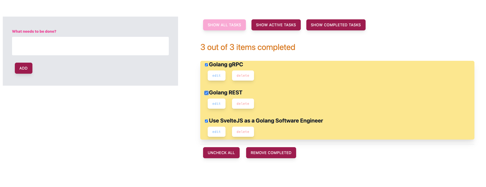

# todo-staticweb-sveltejs-tailwind-ts


Todo App with SvelteJS, Tailwind and TypeScript (TS).

This project is added here for Demo.

Initially do:
```
npm install
```

For build only:

```shell
npm run build
```

For dev:
```shell
npm run dev
```

For prod:
```shell
npm run build
npm run start
```

Visit
```
http://localhost:5000/
```

